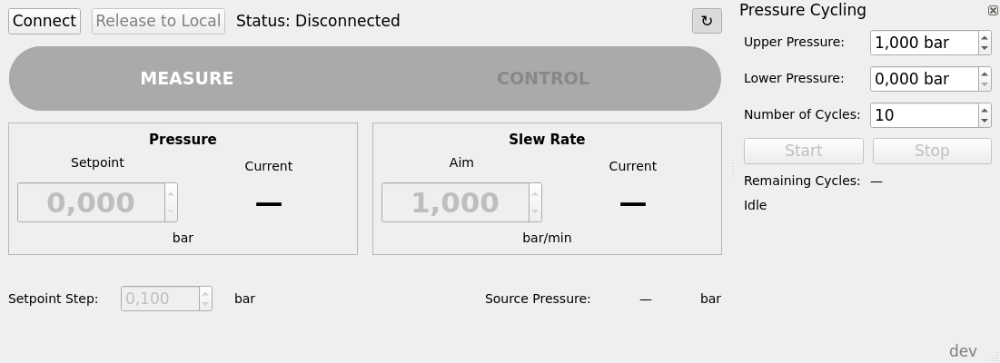

# SqueezeCtrl

A small PyQt5 desktop app for controlling a GE Druck PACE Series pressure
controller over VISA/SCPI (USB or Ethernet).



## Features

- Switch between MEASURE and CONTROL mode
- Set a target pressure and slew rate, with live pressure/rate readouts
- On connect, syncs the setpoint, slew rate, and mode from the instrument's
  actual live state, rather than showing stale defaults
- Run an automated pressure cycling sequence — upper/lower pressure,
  cycle count, start/stop, and a remaining-cycles counter — from a
  dockable side panel
- Auto-discover the instrument over USB/Ethernet, or connect by IP
  directly for static-IP Ethernet instruments that don't answer discovery
- **Release to Local**: hands control back to the instrument's front panel
  reliably. Just pressing the instrument's own on-screen local control
  doesn't work while this app is connected — any SCPI traffic, including
  routine polling, immediately re-arms remote lockout. This button pauses
  the app first, so the release actually sticks; **Resume Remote Control**
  restarts it and re-syncs in case anything changed at the panel meanwhile
- Warns if the instrument's own pressure unit isn't set to bar, since the
  app only interprets bar (and bar/min for rate)

## Download

If you just want to run the app on Windows, no coding tools needed:

1. Go to the [Releases page](../../releases/latest).
2. Under **Assets**, click `SqueezeCtrl.exe` to download it.
3. Double-click the downloaded file to run it.

## Install from source

Requires [uv](https://docs.astral.sh/uv/) and Python 3.11+.

```sh
uv sync
```

## Run

```sh
uv run SqueezeCtrl
```

On connect, the app tries to auto-discover the instrument over USB/Ethernet;
if nothing is found, it falls back to asking for an IP address directly.

## Building the Windows executable

Pushing a version tag (`vX.Y.Z`) builds `SqueezeCtrl.exe` via GitHub Actions
and publishes it to the [Releases page](../../releases) automatically. The
tag is stamped into the build and shown in the app's status bar, so the
running app's version always matches what was actually released.

To build it manually instead, on Windows:

```sh
uv sync --group build
uv run pyinstaller SqueezeCtrl.spec
```

The executable is written to `dist/SqueezeCtrl.exe`.

## Raw instrument test notebook

`notebooks/instrument_raw_tests.ipynb` exercises the VISA/SCPI commands
directly, outside the GUI — useful for checking a command against real
hardware. Open it with:

```sh
uv run notebook
```
